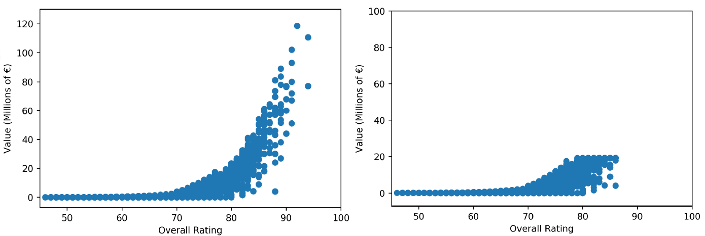
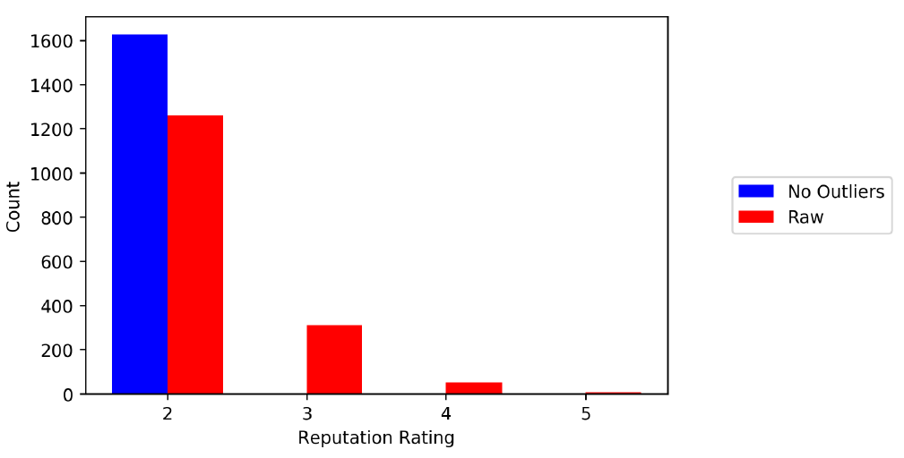

## Scope
Regression task to predict the overall rating of a player based on player features

## Dataset Description
The [dataset](https://www.kaggle.com/karangadiya/fifa19) contains the attribute data for every player (n = approx. 18K) in the FIFA 19 game.
There are 89 features that describe a player. Nominal features, for example the <em>club</em> the player plays for, <em>position, nationality, work rate,</em> and <em>preferred foot</em> of a player, and quantitative features such as <em>height, weight, wage, market value,</em> and skill attribute ratings comprise this dataset. Skill attributes indicating how good a player is are numerical ratings on a scale from 0-100 or 1-5.

## Approach
### Data cleaning:
  - 48 players who were missing value for a majority of the features were removed from the dataset
  - Text in values for numerical features were removed
  - <em>Height</em> was converted to inches
  - <em>Market Value</em> was scaled to be quantified in millions

### Feature Engineering:
  - Split <em>Work Rate</em> into <em>Attacking Work Rate</em> and <em>Defensive Work Rate</em>
  - Created a new feature <em>Position Category</em> by grouping similar positions (e.g. <em>CAM, LAM, RAM</em> were grouped into <em>Attacking Midfield</em>)
  - One-hot encoded categorical features
  - Applied standard scaling to numerical features

### Outliers
A value was deemed to be an outlier if it was beyond +/- 3 standard deviations of the corresponding feature.
Initially, outliers were replaced with the most extreme admissible value within +/- 3 standard deviations but this transformed the data to a degree that greatly affected the model. By deeming values as outliers, the essence of the data was eliminated as a large number of players were grouped together. Any model built using the outlier-free dataset would consequently lose its ability distinguish players. Therefore, no outliers were replaced for model training.

Figure 1. The plot on the left represents the raw market value data while the plot on the right represents the market value data where outliers were replaced with extreme values within +/- 3 standard deviations.

Figure 2. This graph shows how the <em>reputation rating</em> data is affected by removing outliers.

## Results
Root mean square error (RMSE) was the metric used to evaluate model performance.

Table 1. Model performance when all players were considered independent of position

| Algorithm      | RMSE |
| ----------- | ----------- |
| Linear      | 1.6903 |
| Decision Tree   | 0.7104 |
| KNN   | 0.2756 |
| Random Forest   | 0.4550 |

K-Nearest Neighbours (KNN) regression performed best also when position groupings were applied. The KNN model for each position group yielded lower RMSE than linear, decision tree, and random forest models. Plots for each model that was trained for each position grouping are shown in this [notebook](https://github.com/mdjoh/CEBD1260-Project/blob/master/Code/Final%20Project%20-%20FIFA%20Machine%20Learning.ipynb).

### Feature Importance
Features that are generic—not specifically reflective of a particular position—were found to be important in the model considering all players. The top five features for importance were <em>market value, age, potential, reactions,</em> and <em>age</em>. Upon further examining the sorted list of feature importance, <em>finishing</em> and goalkeeper-specific features are deemed to be the most important position-related features in the regression model. One can interpret this as scoring and goalkeeping abilities are among the strongest features to predict overall rating. Goalkeeping features having highest importances could be due these features being responsible for goalkeepers having high overall ratings despite most of the attribute ratings (which are more reflective of outfield players) being low.

Positional ratings and skill attributes commonly associated with a certain position group were among the most important features for position-specific regression models. For example, <em>RS, LS, ST</em> position ratings and <em>reactions</em> and <em>heading accuracy</em> skill attributes were some of the most important features when predicting the overall rating for forwards.

## Limitations
Position ratings closely resembling the target feature essentially made for data leakage. Position rating features were far and away more important than other features for every outfield position group. This likely contributed heavily in lowering the RMSE for all outfield position-specific models.

By building a model with a dataset that was split by position group, the model could be subject to overfitting as a smaller dataset was used during training. It is a possibility that the obtained results may have been overfit.

## Future Directions
To combat against data leakage, position ratings should be excluded from model training and evaluation. This should result in a regression model that is capable of predicting the overall rating solely based on other player attributes.

Future attempts to build a predictive model with the FIFA 19 dataset should consider using boosting algorithms such as XGBoost, LGBM, and CatBoost and target encoding in lieu of one-hot encoding. Literature has shown that boosting algorithms yield very performant models and are often superior to the algorithms explored in this project. Boosting algorithms and hyperparameter tuning should increase predictive performance.

Rather than a regression task, a classification task of predicting the most appropriate position can be also done with this dataset.

