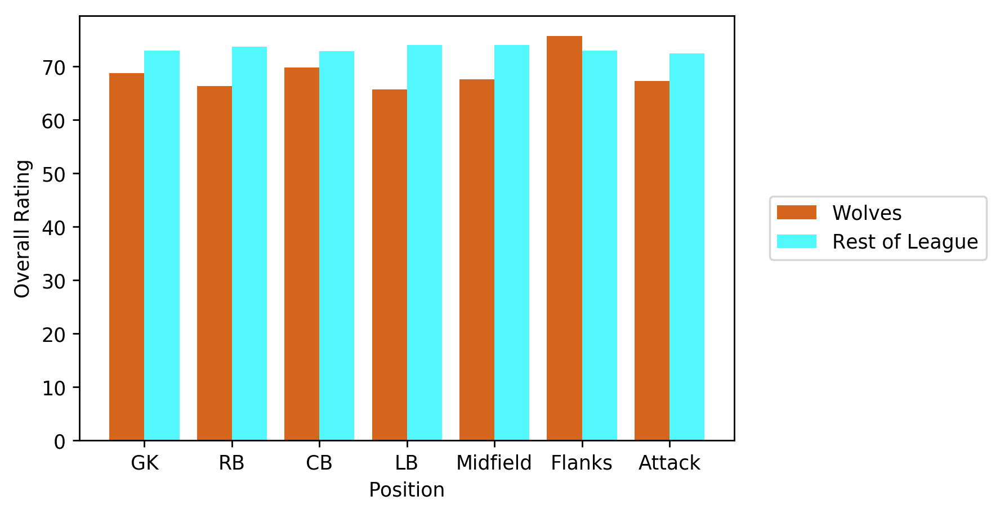
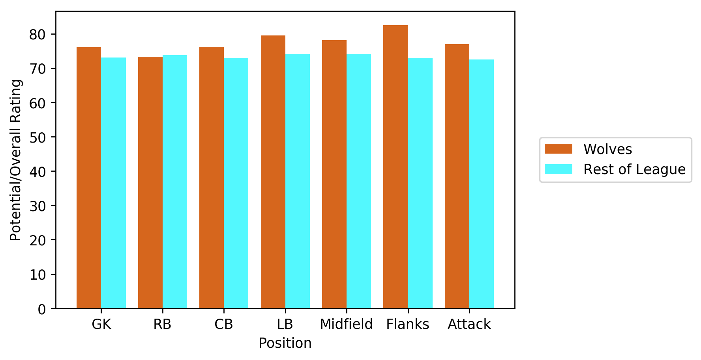
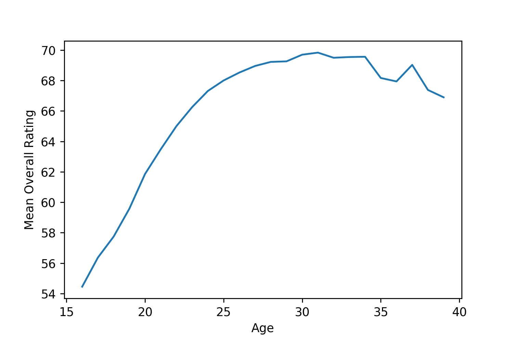
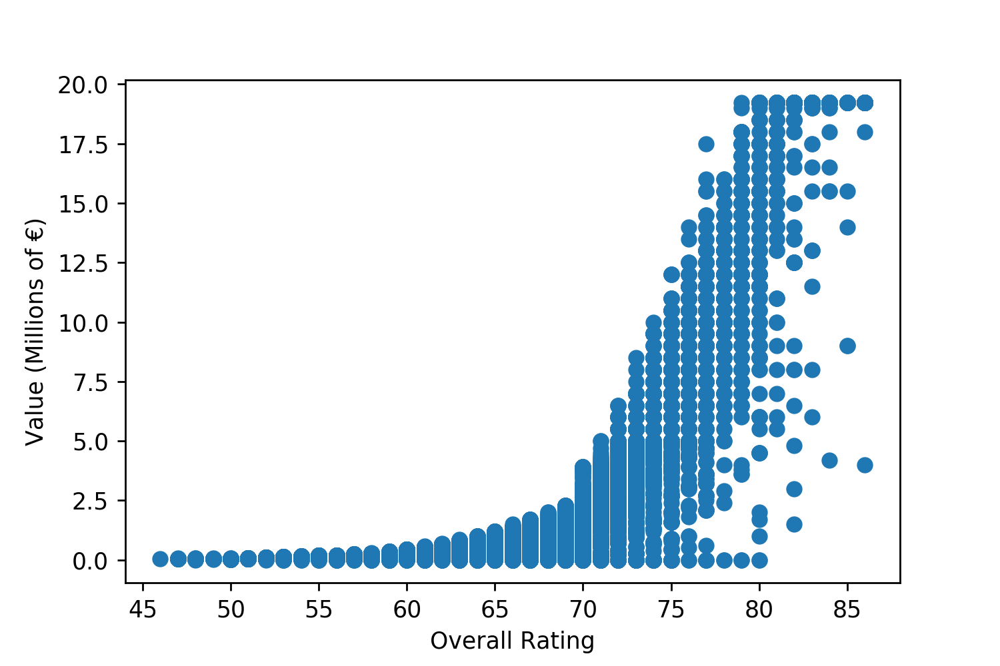

# FIFA 19 Wolverhampton Wanderers Data Story

As a club that gained promotion to the Premier League for this season, Wolverhampton Wanderers (Wolves) face a challenge in being competitive in the English Premier League. The club needs to be competitive to obtain good results so it does not get relegated back to the second division.

So, as the team is currently constructed, can Wolves sustain competitiveness in the Premier League and obtain the necessary results to at least ensure they will not be relegated? If not, what should be done to field a competitive team?

Being in the top tier league puts Wolves among elite clubs but brings into light the fact that the player talent level at Wolves is behind that of the 17 clubs that were in the Premier League last season and that were not relegated. To not suffer relegation from the Premier League, a club must place 17th place or higher in the final standings. However, it would be in the best interest of any club to be good enough to not have to worry about relegation and be in consistent contention for higher positions in the league standings.

As the club is currently constructed, Wolves has a mean player overall rating of 68.82 whereas the 17 clubs that competed last season in the Premier League has a mean rating of 73.24. When examined by position groups, Wolves is behind the average player overall rating of the Premier League at every position except for the wide position in midfield/up front.

Wolves can be more competitive with the rest of the league if all the current players on the team realize their full potential as shown here:

When investigating potential, the potential of Wolves still trails other Premier League clubs in player overall rating in the right-back position. This is certainly a position of need for Wolves that should be addressed with more talented players. The previous figure shows the best-case scenario for Wolves where player transactions do not occur and players on other Premier League clubs do not progress whatsoever in fulfilling their potential. The scenario however is unlikely as player transactions do occur and other clubs have players that will likely develop and fulfill some degree of their potential as well. This illustrates the need for Wolves to target players outside of the club to improve the team.

If no action is taken to improve the squad, Wolves will likely be in a battle to stave off relegation from the Premier League which can be detrimental to the club. The club would probably be forced to sell good players that are currently on the team at below-market prices to alleviate financial pressures placed on the club by not playing in the Premier League. Wolves would suffer a massive setback and would likely struggle to regain promotion back to the top division without good players.

As a solution, players that have the potential to develop into higher-rated players currently at lower market values should be targeted for transfers. According to the figure above, overall rating is still increasing and players enter the prime of their playing careers at approximately age 24. This is likely the latest point in a player’s career where a club can optimize its return-on-investment (ROI) of the player. Therefore, players aged 24 or younger, who are the least valued, and who are currently rated greater than the Premier League mean of 73.24 overall are the recommended transfer targets. The targeted players would immediately improve player quality at Wolves to be more competitive in the Premier League. These players would also help the club obtain good financial results as the market value of players increase if they fulfill their potential thereby increasing the club’s ROI.

Examples of players that meet the criteria and play in positions that address areas of need for Wolves are presented in the following table.

These players should be considered as some of the potential transfer targets that can benefit the club.
