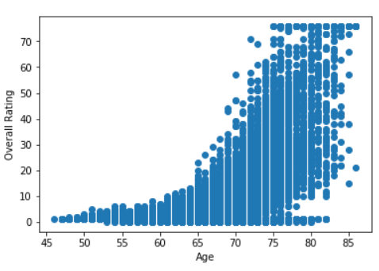
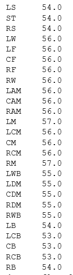
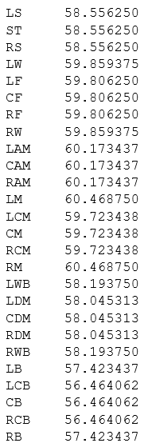
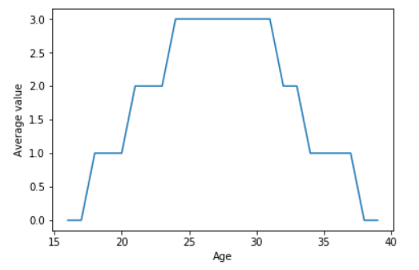
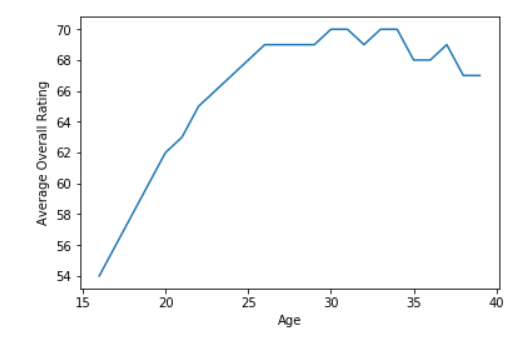

### Explanation of the dataset

The FIFA 19 dataset is composed of qualitative and quantitative attributes for every player in theEA Sports video game FIFA 19. The dataset has 89 player attribute features and over 18,000 players listed. Nominal features, for example the club the player plays for, position, nationality, work rate, and preferred foot of a player, and quantitative features such as height, weight, wage,market value, and skill ratings comprise this dataset. Skill attributes indicating how good a player is are numerical ratings on a scale of 100 or on a scale of 5.

In the year 2018, Wolverhampton was promoted to the Premier League since its delegation 6 years ago. It is the time now to invest and develop the team to be competitive in the Premier League and avoid the delegation again. This dataset (found [here](https://www.kaggle.com/karangadiya/fifa19)) is useful to validate the current status of the team, understand and analyze the weak and strong aspect to rebuild the team fit for the Premier League.

### Analysis of the current status of the team.

Graph 1 shows the relationship between the wage and the rate of the player. As can be seen from the graph, the relationship between the player rating and his wage is a linear relationship. 

The average Wolverhampton wage is **28.87** while that of the whole league is **39.30**. Teams with higher wage, thus with players with higher rating, tend to survive and perform well in the league. Therefore, if we can bring in the players with higher rate, it would be possible to survive in the league.

Figure 2 and 3 represents the average rate of position of Wolverhampton and all the team in the league respectively. The mean absolute error for these positions is approximately **3.65**. To eradicate the error, we need bring players with higher rating than the average of the team, while letting go players with lower rating to be close to the average team rating.

To be able to afford the players with higher rating, it would be recommended to target younger players with higher potential. Graph 2 and 3 shows that the younger the player is, the cheaper it is to afford them, but they have lower rating. Therefore it is essential to find players with higher potential, as they can be sold in the future to generate revenue to invest in the team.

